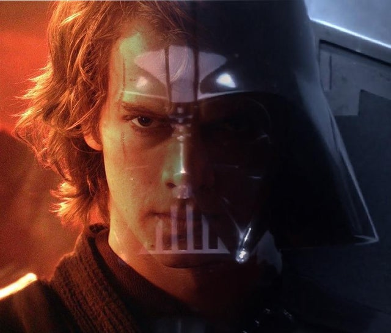

# 🐲 Workshop C++ S1 - IMAC

**Workshop créé par [Jules Fouchy](https://github.com/JulesFouchy).**

🎓 *Étudiants : DE SANTIS Léo & DUPUIS Maxence.*

**On s'intéresse ici à la création d'effets sur des images avec C++ !**
**Il s'agit d'une première introduction à la synthèse d'image.**
<br>

\*📁 Cet émoji vous permet d'accéder directement au code source des projets.
<br>
<br>

## :triangular_flag_on_post: Les bases

On utilise la bibliothèque **sil**.

- **sil** nous permet de lire, éditer (via les pixels) et sauvegarder des images.

```cpp
#include <sil/sil.hpp> //Directive de préprocesseur pour inclure sil

 sil::Image image{"mon_image.png"}; //Import d'une image

    image.save("resultat.png"); //Sauvegarde et affichage de l'image
```
<br>
<br>


## ⭐ Ne garder que le vert

| Avant                        | Après                                  |
| ---------------------------- | -------------------------------------- |
|  |  |

📁 [Code source](https://github.com/smallboyc/imac-cpp-workshop/blob/main/src/green/main.cpp)

### Description :

- On souhaite simplement garder active la composante Verte.

### Spécificités :

- Il suffit de rendre nulle les composantes rouge et bleu de chaque pixels en les parcourant.

```cpp
int main()
{
    sil::Image image{"images/logo.png"};
    for (glm::vec3 &color : image.pixels())
    {
        color.r = 0.f;
        color.b = 0.f;
    }
    image.save("output/pouet.png");
}
```

<br>
<br>


## ⭐ Échanger les canaux

| Avant                        | Après                                     |
| ---------------------------- | ----------------------------------------- |
|  |  |

📁 [Code source](https://github.com/smallboyc/imac-cpp-workshop/blob/main/src/exchange/main.cpp)

### Description :

- On souhaite inverser les canaux RGB entre eux. Essayons d'inverser le canal bleu et rouge.

### Spécificités :

- Méthode 1 : Utiliser une variable temporaire.
- Méthode 2 : Utiliser la fonction **swap** de la bibliothèque standard pour échanger 2 valeurs.
```cpp
//Méthode 1
int main()
{
    sil::Image image{"images/logo.png"};
    for (glm::vec3 &color : image.pixels())
    {
        float temp{color.b};
        color.b = color.r;
        color.r = temp;
    }
    image.save("output/pouet.png");
}
```
```cpp
//Méthode 2
int main()
{
    sil::Image image{"images/logo.png"};
    for (glm::vec3 &color : image.pixels())
        std::swap(color.b, color.r);
    image.save("output/pouet.png");
}
```
❗**Bien que ce code ne soit pas imposant. La méthode 2 est intéressante pour un code plus lisible et optimisé.**

### Potentiels problèmes

- Écraser une variable
```cpp
int main()
{
    sil::Image image{"images/logo.png"};
    for (glm::vec3 &color : image.pixels())
    {
        color.b = color.r;
        color.r = color.b;
    }
    image.save("output/pouet.png");
}
```
Dans le code ci-dessus, on se retrouve avec un canal bleu ayant la même valeur que celle du canal rouge. On perd l'information sur **color.b**,  d'où l'importance d'une variable temporaire **temp**.


<br>
<br>

##⭐ Noir & Blanc

| Avant                        | Après                                        |
| ---------------------------- | -------------------------------------------- |
|  |  |

📁 [Code source](https://github.com/smallboyc/imac-cpp-workshop/blob/main/src/black_white/main.cpp)

### Description :

- On souhaite transformer notre image en noir et blanc.

### Spécificités :

- Il faut faire la moyenne de la somme des composantes RGB de chaque pixels, et attribuer à chaque canaux le résultat de ce calcul. Ce résultat se nomme **la nuance de gris**.
```cpp
int main()
{
    sil::Image image{"images/logo.png"};
    for (glm::vec3 &color : image.pixels())
    {
        float moyenne{(color.r + color.g + color.b) / 3.0f};
        color.r = moyenne;
        color.g = moyenne;
        color.b = moyenne;
    }
    image.save("output/pouet.png");
}
```

<br>
<br>

## ⭐ Négatif

| Avant                        | Après                                     |
| ---------------------------- | ----------------------------------------- |
|  |  |

📁 [Code source](https://github.com/smallboyc/imac-cpp-workshop/blob/main/src/negative/main.cpp)

### Description :

- On souhaite inverser le noir et le blanc 

### Spécificités :

- Analysons... On veut que :
> 0 ➡️ 1, 1 ➡️ 0, 0.8 ➡️ 0.2 ...
- En généralisant on devine la formule : **f(x) = 1 - x**
- Il suffit donc d'**appliquer cette formule** aux composantes RGB de tous nos pixels !

<br>
<br>

## ⭐ Dégradé


📁 [Code source](https://github.com/smallboyc/imac-cpp-workshop/blob/main/src/mosaique_miroir/main.cpp)

### Description :

- On souhaite parcourir toute notre largeur en passant progressivement du noir au blanc.

### Spécificités :

- On remarque que si on fixe un **x** quelconque, les **y** correspondant ne changent pas. On a donc des lignes verticales de même valeur.
- **x** varie de **0** à **width - 1** (largeur de l'image).
- La variation de teinte doit donc prendre en compte la **width** (largeur) et la variable **x**.
- On doit faire le rapport **x / (width - 1)** pour chaque pixel. En effet, ce rapport nous donne 1 si on arrive au dernier pixel et 0 au départ. L'incrément nous donnera une valeur de plus en plus blanche. **BINGO !** 😜


```cpp
int main()
{
    sil::Image image{300, 200};
    for (float x{0}; x < image.width(); x++)
    {
        for (float y{0}; y < image.height(); y++)
        {
            image.pixel(x, y).r = x / (image.width() - 1);
            image.pixel(x, y).g = x / (image.width() - 1);
            image.pixel(x, y).b = x / (image.width() - 1);
        }
    }
    image.save("output/pouet.png");
}
```

### Potentiels problèmes

- Remplacer le **float** par un **int**. 
- Les valeurs prises par les composantes RGB sont des nombres décimaux variants de 0 à 1.
- Diviser un **int** par un **int**, ça donne... un **int** ! Et donc, nos valeurs seraient toutes arrondies à 0, sauf le rapport donnant tout juste 1 ! A savoir le **dernier pixel** (voir résultat ci-dessous).


  ❗**Les bords gris ont été rajoutés pour bien discerner l'erreur.**

<br>
<br>

## ⭐⭐ Miroir

| Avant                          | Après                                   |
| ------------------------------ | --------------------------------------- |
|  |  |

📁 [Code source](https://github.com/smallboyc/imac-cpp-workshop/blob/main/src/mirror/main.cpp)

### Description :

- On souhaite effectuer une rotation verticale de notre image.

### Spécificités :

- L'idée est de parcourir chaque pixel et d'échanger le pixel concerné par le pixel qui lui est **opposé en x**.
- Il faut cependant seulement **parcourir le moitié de la largeur**. En effet, arrivé à la moitié, notre image aura déjà été inversée.
  
```cpp
int main()
{
    sil::Image image{"images/anakin.jpg"};
    for (int x{0}; x < image.width() / 2; x++)
    {
        for (int y{0}; y < image.height(); y++)
        {
            std::swap(image.pixel(x, y), image.pixel(image.width() - (x + 1), y));
        }
    }
    image.save("output/pouet.png");
}
```

### Potentiels problèmes
- Parcourir la totalité de la **width**. La conséquence, c'est d'avoir une image **similaire** à celle d'origine. En réalité, elle aura été inversée **2 fois**.


<br>
<br>

## ⭐⭐⭐ Mosaïque miroir

| Avant                          | Après                                                                      |
| ------------------------------ | -------------------------------------------------------------------------- |
|  |  |

📁 [Code source](https://github.com/smallboyc/imac-cpp-workshop/blob/main/src/mosaique_miroir/main.cpp)

### Description :

- Similaire à une mosaïque classique, mais on y ajoute des renversements ciblés sur l'axe **x** et **y**.

### Spécificités :

- On sait comment obtenir la mosaïque (c'est déjà bien).
- Maintenant, on remarque que toutes les images sur les colonnes impaires subissent un miroir par rapport à la verticale (on sait faire ça, on l'a fait sur l'algorithme ⭐⭐ **Miroir**). 
- On remarque aussi que toutes les lignes impaires subissent un miroir par rapport à l'horizontale (en fait c'est le ⭐⭐**Miroir** adapté pour l'horizontale. Il suffit juste d'inverser **y** et **x**).
- L'idée est donc de créer une fonction qui nous permettrait de renverser soit selon la verticale, soit selon l'horizontale. On va utiliser un booléen qui conditionnera nos variables. Allez let's go!
```cpp
void mirror(sil::Image &image, bool const reverse_y)
{
    int divide_x{2};
    int divide_y{1};

    if (reverse_y)
    {
        divide_x = 1;
        divide_y = 2;
    }

    for (int x{0}; x < image.width() / divide_x; x++)
    {
        for (int y{0}; y < image.height() / divide_y; y++)
        {
            int select_x{image.width() - (x + 1)};
            int select_y{y};
            if (reverse_y)
            {
                select_x = x;
                select_y = image.height() - (y + 1);
            }

            std::swap(image.pixel(x, y), image.pixel(select_x, select_y));
        }
    }
}
```
- Voilà la fonction *mirror* ! Si je passe **reverse_y** à **false**, on aura notre ⭐⭐ **Miroir**, si on le set à **true**, c'est la même chose mais selon les **y**.
  
```cpp
int main()
{
    sil::Image const image{"images/arcane.jpg"};
    int ratio{8};
    bool reverseEffect{true};
    sil::Image newImage{ratio * image.width(), ratio * image.height()};

    for (int i{0}; i < ratio; i++)
        for (int j{0}; j < ratio; j++)
        {
            sil::Image copy{image};

            if (reverseEffect)
            {
                if (j % 2 != 0)
                    mirror(copy, false);

                if (i % 2 != 0)
                    mirror(copy, true);
            }

            printPoster(copy, newImage, j * image.width(), i * image.height());
        }

    newImage.save("output/pouet.png");
}
```
- Voilà le *main* avec un booléen **reverseEffect**. Si ce dernier est set à **false**, on retrouvera notre **mosaïque classique**. Sinon, on applique nos changements et **BOOM**, ça fait des chocapics !

### Potentiels problèmes
- Oublier l'**&** (Référence): Fondamentale pour garder le **lien** avec la variable d'origine, et donc de pouvoir garder et **modifier de l'information** dans une fonction. On a alors une **portée globale** (la modification d'une variable interne à la fonction a une répercussion sur la variable, partout dans le code). Il ne faut surtout pas l'oublier quand on passe l'**image** en paramètre de notre fonction.
- Oublier de faire une **copy** de l'image dans le *main* à l'intérieur de notre boucle est une erreur. Si on cible l'image défini au début du *main* directement, le miroir appliqué à notre image ne se réinitialise pas. On travaille avec une **même image** qui **cumule les miroirs**, et on est pas au bout de nos surprises.
<br>
<br>

## ⭐⭐⭐ Glitch
| Avant                        | Après                                          |
| ---------------------------- | ---------------------------------------------- |
|  |  |

📁 [Code source](https://github.com/smallboyc/imac-cpp-workshop/blob/main/src/glitch/main.cpp)
### Description :

- On souhaite sélectionner 2 rectangles de pixels aux hasard dans l'image et les échanger. Les tailles sont gérés aléatoirement mais les 2 rectangles doivent avoir la même taille.

### Spécificités :
- On va utiliser la librairie `glm` pour manipuler des `vec2` nous permettant de stocker une position x et y. Notre code sera alors plus lisible et plus simple à gérer.
- L'idée est de générer 2 `vec2`. Un 1er avec la position du pixel de départ de notre 1er rectangle. Et un second avec la position de départ du 2ème rectangle.
- L'idée est de parcourir une taille commune `rectangleSize` pour pouvoir échanger un nombre de pixel

## ⭐⭐⭐⭐ Tri de pixels

| Avant                        | Après                                          |
| ---------------------------- | ---------------------------------------------- |
|  |  |

📁 [Code source](https://github.com/smallboyc/imac-cpp-workshop/blob/main/src/pixel_sorting/main.cpp)

### Description :

- On souhaite récupérer une portion rectangulaire de pixels. Cette portion doit être trié en fonction de l'intensité. Ainsi le pixel le plus lumineux se trouve au début de la portion et le moins lumineux à la fin. On replace ensuite la portion dans l'image au même endroit.

### Spécificités :
- On nous donne la fonction suivante, permettant de trier les éléments d'un tableau `table`.
```cpp
std::sort(table.begin(), table.end(), [](glm::vec3 &color1, glm::vec3 &color2)
{ return brightness(color1) < brightness(color2); });
```
- Voici la fonction `brightness` qui retourne la somme des composantes RGB d'un pixel.
```cpp
float brightness(glm::vec3 &color)
{
    return (color.r + color.g + color.b);
}
```

- L'idée est de s'inspirer du glitch en sélectionnant un rectangle de pixel. On trouve aléatoirement un pixel de départ sur l'image et on parcourt une taille généré aléatoirement (pas trop grande non plus) et on fixe pour ce code `y` à 1.
```cpp
  glm::vec2 inputPositionStart{random_int(0, image.width()), random_int(0, image.height())};
  glm::vec2 rectangleSize{random_int(20, 30), 1};
```
- Chaque pixel du rectangle est push dans un tableau.
```cpp
 for (int i{0}; i < rectangleSize.x; i++)
    {
        for (int j{0}; j < rectangleSize.y; j++)
        {
            if (inputPositionStart.x + i < image.width() &&
                inputPositionStart.y + j < image.height())
                table.push_back(image.pixel(inputPositionStart.x + i, inputPositionStart.y + j));
        }
    }
```
- On appelle la fonction de tri sur `table`.
- On doit alors finalement boucler de la même façon sur notre rectangle en attribuant aux positions, les nouveaux pixels triés du tableau.
- On utilise alors une variable `count` pour parcourir notre tableau.
  
```cpp
   int count{0};
    for (int i{0}; i < rectangleSize.x; i++)
    {
        for (int j{0}; j < rectangleSize.y; j++)
        {
            if (inputPositionStart.x + i < image.width() &&
                inputPositionStart.y + j < image.height())
            {

                image.pixel(inputPositionStart.x + i, inputPositionStart.y + j) = table[count];
                count++;
            }
        }
    }
```
- On obtient là un rectangle trié. Il suffit maintenant de boucler!
- Tout le code ci-dessus a été implémenté dans une fonction `getRectangle()` excepté la fonction `brightness`.
```cpp
int main()
{
    sil::Image image{"images/logo.png"};
    for (int i{0}; i < 1000; i++)
        getRectangle(image);
    image.save("output/pouet.png");
}
```
### Potentiels problèmes
- Oublier le `count`. Cette variable est essentielle pour être certain de parcourir tout notre tableau trié et ainsi de placer les pixels au bon endroit.
- Ne pas vérifier les bornes. Il faut en effet s'assurer que les pixels que l'on manipule se trouvent dans l'image.