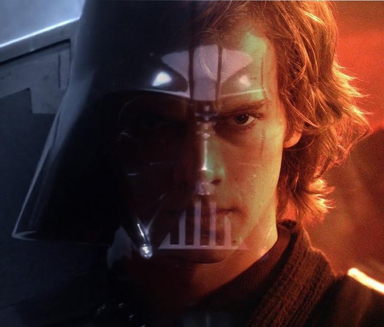

# 🐲 Workshop C++ S1 - IMAC

**Workshop créé par [Jules Fouchy](https://github.com/JulesFouchy).**

🎓 *Étudiants : DE SANTIS Léo & DUPUIS Maxence.*

**On s'intéresse ici à la création d'effets sur des images avec C++ !**
**Il s'agit d'une première introduction à la synthèse d'image.**
<br>

\*📁 Cet émoji vous permet d'accéder directement au code source des projets.
<br>
<br>

## :triangular_flag_on_post: Les bases

On utilise la bibliothèque **sil**.

- **sil** nous permet de lire, éditer (via les pixels) et sauvegarder des images.

```cpp
#include <sil/sil.hpp> //Directive de préprocesseur pour inclure sil

 sil::Image image{"mon_image.png"}; //Import d'une image

    image.save("resultat.png"); //Sauvegarde et affichage de l'image
```
<br>
<br>


## ⭐ Ne garder que le vert

| Avant                        | Après                                  |
| ---------------------------- | -------------------------------------- |
|  |  |

📁 [Code source](https://github.com/smallboyc/imac-cpp-workshop/blob/main/src/green/main.cpp)

### Description :

- On souhaite simplement garder active la composante Verte.

### Spécificités :

- Il suffit de rendre nulle les composantes rouge et bleu de chaque pixels en les parcourant.

```cpp
int main()
{
    sil::Image image{"images/logo.png"};
    for (glm::vec3 &color : image.pixels())
    {
        color.r = 0.f;
        color.b = 0.f;
    }
    image.save("output/pouet.png");
}
```

<br>
<br>


## ⭐ Échanger les canaux

| Avant                        | Après                                     |
| ---------------------------- | ----------------------------------------- |
|  |  |

📁 [Code source](https://github.com/smallboyc/imac-cpp-workshop/blob/main/src/exchange/main.cpp)

### Description :

- On souhaite inverser les canaux RGB entre eux. Essayons d'inverser le canal bleu et rouge.

### Spécificités :

- Méthode 1 : Utiliser une variable temporaire.
- Méthode 2 : Utiliser la fonction **swap** de la bibliothèque standard pour échanger 2 valeurs.
```cpp
//Méthode 1
int main()
{
    sil::Image image{"images/logo.png"};
    for (glm::vec3 &color : image.pixels())
    {
        float temp{color.b};
        color.b = color.r;
        color.r = temp;
    }
    image.save("output/pouet.png");
}
```
```cpp
//Méthode 2
int main()
{
    sil::Image image{"images/logo.png"};
    for (glm::vec3 &color : image.pixels())
        std::swap(color.b, color.r);
    image.save("output/pouet.png");
}
```
❗**Bien que ce code ne soit pas imposant. La méthode 2 est intéressante pour un code plus lisible et optimisé.**

### Potentiels problèmes

- Écraser une variable
```cpp
int main()
{
    sil::Image image{"images/logo.png"};
    for (glm::vec3 &color : image.pixels())
    {
        color.b = color.r;
        color.r = color.b;
    }
    image.save("output/pouet.png");
}
```
Dans le code ci-dessus, on se retrouve avec un canal bleu ayant la même valeur que celle du canal rouge. On perd l'information sur **color.b**,  d'où l'importance d'une variable temporaire **temp**.


<br>
<br>

##⭐ Noir & Blanc

| Avant                        | Après                                        |
| ---------------------------- | -------------------------------------------- |
|  |  |

📁 [Code source](https://github.com/smallboyc/imac-cpp-workshop/blob/main/src/black_white/main.cpp)

### Description :

- On souhaite transformer notre image en noir et blanc.

### Spécificités :

- Il faut faire la moyenne de la somme des composantes RGB de chaque pixels, et attribuer à chaque canaux le résultat de ce calcul. Ce résultat se nomme **la nuance de gris**.
```cpp
int main()
{
    sil::Image image{"images/logo.png"};
    for (glm::vec3 &color : image.pixels())
    {
        float moyenne{(color.r + color.g + color.b) / 3.0f};
        color.r = moyenne;
        color.g = moyenne;
        color.b = moyenne;
    }
    image.save("output/pouet.png");
}
```

<br>
<br>
<br>

##⭐ Négatif

| Avant                        | Après                                     |
| ---------------------------- | ----------------------------------------- |
|  |  |

📁 [Code source](https://github.com/smallboyc/imac-cpp-workshop/blob/main/src/negative/main.cpp)

<br>
<br>
<br>

##⭐ Dégradé


📁 [Code source](https://github.com/smallboyc/imac-cpp-workshop/blob/main/src/mosaique_miroir/main.cpp)

<br>
<br>
<br>

## Miroir

| Avant                          | Après                                   |
| ------------------------------ | --------------------------------------- |
|  |  |

📁 [Code source](https://github.com/smallboyc/imac-cpp-workshop/blob/main/src/mirror/main.cpp)

<br>
<br>
<br>

##⭐⭐⭐ Mosaïque miroir

| Avant                          | Après                                                                      |
| ------------------------------ | -------------------------------------------------------------------------- |
|  |  |

📁 [Code source](https://github.com/smallboyc/imac-cpp-workshop/blob/main/src/mosaique_miroir/main.cpp)

<br>
<br>
<br>

##⭐⭐⭐⭐ Tri de pixels

| Avant                        | Après                                          |
| ---------------------------- | ---------------------------------------------- |
|  |  |

📁 [Code source](https://github.com/smallboyc/imac-cpp-workshop/blob/main/src/pixel_sorting/main.cpp)
