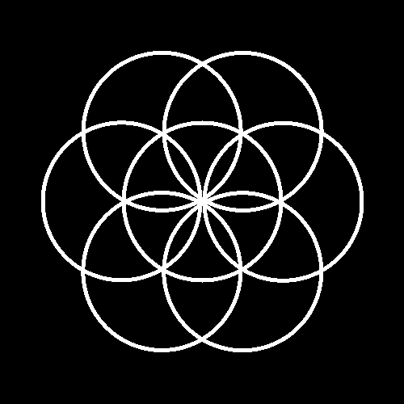

# 🐣 S1 | Prog: Workshop

## ⭐⭐ Image Bruitée

| Avant | Après |
| ----------- | ----------- |
|  |  |

📁 [Code source](src/noise/main.cpp)

### Description
Dans cet exercice, un effet aléatoire de couleur (bruit) a été appliqué à l'image. Chaque pixel de l'image a été modifié en assignant une couleur aléatoire. Pour ce faire, les composantes R (rouge), G (vert) et B (bleu) de chaque pixel ont été remplacées par des valeurs aléatoires comprises entre 0 et 1.

### Spécificités
- Utilisation d'une fonction de génération de nombres aléatoires

### Pièges potentiels à éviter
- Aucun

<br>

## ⭐⭐ Rotation de 90°

| Avant | Après |
| ----------- | ----------- |
|  |  |

📁 [Code source](src/rotate_90/main.cpp)

### Description
Dans cet exercice, une rotation de l'image originale à 90 degrés dans le sens horaire a été effectuée. L'algorithme utilise une approche de manipulation des pixels pour réaliser cette rotation.

### Spécificités
- Parcourir chaque pixel de l'image d'origine et le placer dans une nouvelle image avec des coordonnées modifiées pour effectuer la rotation.
- L'implémentation de la rotation se fait en échangeant les coordonnées x et y des pixels entre l'image d'origine et la nouvelle image résultante.
- Une seconde méthode, actuellement commentée dans le code, utilise une autre approche par inversion des colonnes après avoir effectué la rotation en utilisant la fonction : `std::swap`

### Pièges potentiels à éviter
- Oublier le `-1`. Il permet de tourner l'image dans le sens anti-horaire comme souhaité.
```cpp
    voidImage.pixel(voidImage.width() - 1 - y, x) = image.pixel(x, y);
```

<br>

## ⭐⭐ RGB Split

| Avant | Après |
| ----------- | ----------- |
|  |  |

📁 [Code source](src/rgb_split/main.cpp)

### Description
Dans cet exercice, un effet de séparation des canaux RGB (RGB split) a été appliqué à l'image. L'algorithme modifie les canaux Rouge (R), Vert (G), et Bleu (B) de l'image pour créer une version où chaque canal est décalé par rapport aux autres.

### Spécificités
- Trois boucles distinctes sont utilisées pour traiter séparément les composantes Rouge, Vert et Bleu de chaque pixel de l'image.
- Pour chaque composante de couleur, une boucle spécifique effectue un décalage des pixels à gauche ou à droite en fonction du canal (R, G ou B) tout en conservant les autres canaux.

### Pièges potentiels à éviter
- Ne pas oublier de décaler les valeurs de pixels

<br>

## ⭐⭐ Luminosité

| Après Assombrissement | Avant | Après Eclaircissement |
| --- | :-: |  --: |
|  |  |  |

📁 [Code source](src/luminosite/main.cpp)

### Description
Dans cet exercice, un effet d'assombrissement ou d'éclaircissement de l'image a été appliqué en utilisant une variable `number`. Cette variable est utilisée pour modifier la puissance des canaux Rouge (R), Vert (G) et Bleu (B) de chaque pixel de l'image.

### Spécificités
- Une boucle parcourt chaque pixel de l'image et ajuste la valeur de chaque composante de couleur en fonction de la valeur de `number`.
- La fonction `pow` est utilisée pour augmenter ou diminuer la valeur des canaux RVB en fonction de la valeur de `number`, ce qui permet de contrôler l'intensité lumineuse des pixels.

### Pièges potentiels à éviter
- Multiplier les valeurs sans les fonctions puissances. Cela nous donnerait un resultat trop saturé.

<br>

## ⭐⭐ Disque

| Image |
| --- |
|  |

📁 [Code source](src/disque/main.cpp)

### Description
Dans cet exercice, la formation d'un disque a été appliqué à une image de 500x500. L'algorithme remplit les pixels de l'image pour former un disque centré sur l'image.

### Spécificités
- Les pixels situés à l'intérieur du cercle défini par l'équation sont colorés en blanc en vérifiant si sa position correspond à celle à l'intérieur du disque à l'aide d'une équation de cercle.

### Pièges potentiels à éviter
- Aucun

<br>

## ⭐ Cercle

| Image |
| --- |
|  |

📁 [Code source](src/cercle/main.cpp)

### Description
Dans cet exercice, la formation d'un cercle a été appliqué à une image de 500x500. L'algorithme dessine un cercle avec un rayon et une épaisseur de contours variable.

### Spécificités
- Les pixels situés à l'intérieur du cercle sont laissés vides, tandis que ceux se trouvant dans l'épaisseur des contours sont colorés en blanc en déterminant s'ils se trouvent à l'intérieur du cercle ou dans l'épaisseur de ses contours à l'aide d'une équation de cercle modifiée.

### Pièges potentiels à éviter
- Aucun

<br>

## ⭐⭐⭐ Rosace

| Image |
| --- |
|  |

📁 [Code source](src/rosace/main.cpp)


### Description
Dans cet exercice, la formation d'une rosace a été appliqué à une image de 500x500. L'algorithme dessine une rosace en superposant plusieurs cercles avec des épaisseurs de contour variables.

### Spécificités
- Chaque cercle est défini avec un rayon, une épaisseur de contour et une position de centre différents.
- Le centre défini des cercles est calculé en fonction du cercle trigonométrique par des coordonnées polaires.
### Pièges potentiels à éviter
- Ne pas oublier d'ajouter un nouveau centre pour chaque cercle en fonction du centre de base.

<br>

## ⭐⭐ Mosaïque

| Avant | Après |
| ----------- | ----------- |
|  |  |

📁 [Code source](src/mosaique/main.cpp)

### Description
Dans cet exercice, un effet de mosaïque a été appliqué à l'image en utilisant une version agrandie de l'image originale. L'algorithme divise l'image en une grille de carrés identiques et place des copies de l'image originale dans chaque carré.

### Spécificités
- Une fonction `newImacPoster` est utilisée pour placer une copie de l'image originale à une position spécifique dans la nouvelle image.
- Sur une grille de carrés est utilisé la fonction `newImacPoster` pour répliquer l'image dans chaque carré de la grille, formant ainsi l'effet de mosaïque.
- Le ratio du nombre de carré est modulable grâce à une variable `ratio` présente au début du `main`.

### Pièges potentiels à éviter
- Ne pas oublier de créer une nouvelle image pour y implanter nos autres images

<br>

## ⭐⭐⭐ Fractale de Mandelbrot

| Image |
| --- |
| |

📁 [Code source](src/fractale/main.cpp)

### Description
Dans cet exercice, un algorithme génère une image représentant la fractale de Mandelbrot. La fractale de Mandelbrot est un ensemble de points complexes dans le plan complexe qui produit une forme fractale lorsqu'elle est visualisée.

### Spécificités
- Deux boucles imbriquées parcourent chaque pixel de l'image et effectuent des itérations selon la formule mathématique de la fractale de Mandelbrot.
- Pour chaque pixel de l'image, l'algorithme effectue un certain nombre d'itérations pour déterminer s'il appartient à l'ensemble de Mandelbrot en fonction de sa convergence ou de sa divergence.
- La couleur du pixel est définie en fonction du nombre d'itérations nécessaires avant que la séquence ne diverge.

### Pièges potentiels à éviter
- L'utilisation d'un booléen pour la boucle while. L'algorithme ne parviendrerai pas à sortir de la boucle.

<br>

## ⭐⭐⭐(⭐) Vortex

| Avant | Après |
| ----------- | ----------- |
|  |  |

📁 [Code source](src/vortex/main.cpp)

### Description
Dans cet exercice, un effet de vortex a été appliqué à l'image. L'algorithme effectue une transformation de chaque pixel en utilisant une rotation autour d'un centre donné.

### Spécificités
- Une fonction `rotated` est utilisée pour effectuer la rotation des pixels autour d'un centre de rotation.
- La transformation de rotation est appliqué en fonction de la distance par rapport au centre de l'image.

### Pièges potentiels à éviter
- Sortir de l'image en remplaçant les pixels
- Attriuber les nouvelles coordonnées `newPoint.x, newPoint.y` de la nouvelle image `voidImage`. -> Notre transformation serait décalé par rapport au centre `x,y` de notre image d'origine.
```cpp
            if (newPoint.x < image.width() && newPoint.x >= 0 && newPoint.y < image.height() && newPoint.y >= 0)
                voidImage.pixel(x, y) = image.pixel(newPoint.x, newPoint.y);
```

<br>

## ⭐⭐⭐(⭐) Normalisation de l'histogramme

| Avant | Après |
| ----------- | ----------- |
|  |  |

📁 [Code source](src/normalisation/main.cpp)

### Description
Dans cet exercice, un effet de normalisation de l'histogramme a été appliqué à l'image. L'algorithme détermine le pixel le plus sombre pour le transformer en noir pur `0` et le pixel le plus clair pour le transformer en blanc pur `1`, normalisant ainsi la plage de valeurs des pixels.

### Spécificités
- En utilisant les valeurs identifiées pour le pixel le plus sombre `darkPixel` et le plus clair `whitePixel`, l'algorithme normalise les valeurs RGB de chaque pixel en calculant la moyenne des composantes RGB en fonction du pixel le plus sombre et clair.

### Pièges potentiels à éviter
- Lors du calcul de normalisation, il ne faut pas oublier de multiplie par **l'inverse** de la valeur de notre pixel le plus clair pour ne pas se retrouver avec un histogramme trop sombre.
```cpp
    image.pixel(x, y).r = (image.pixel(x, y).r - darkPixel) * 1 / whitePixel;
    image.pixel(x, y).g = (image.pixel(x, y).g - darkPixel) * 1 / whitePixel;
    image.pixel(x, y).b = (image.pixel(x, y).b - darkPixel) * 1 / whitePixel;
``` 